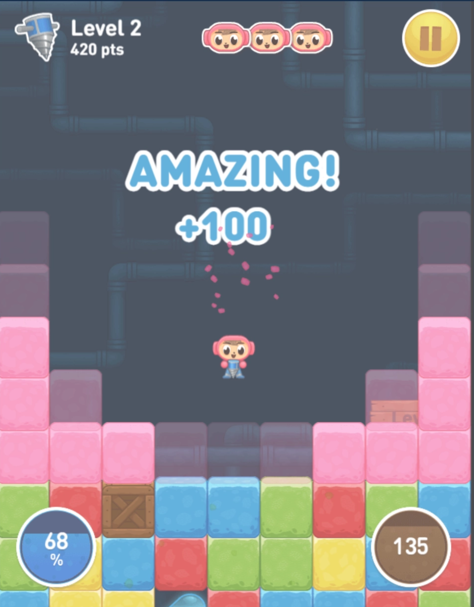
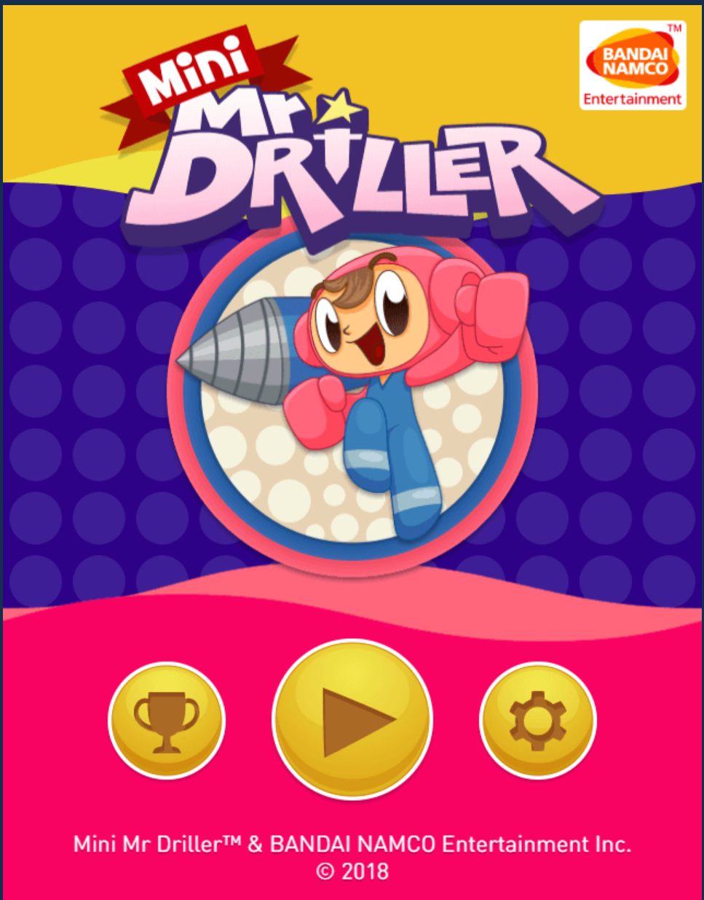

# 미니 드릴러 (Mini Driller) - v1.6

## 📌 프로젝트 관리

[✅ 체크리스트 (Checklist)](%E2%9C%85%20%EC%B2%B4%ED%81%AC%EB%A6%AC%EC%8A%A4%ED%8A%B8%20(Checklist)%2035e070f7557481a0a825ce8b76fa77b2.md)

[📝 할 일 백로그 (Backlog)](%F0%9F%93%9D%20%ED%95%A0%20%EC%9D%BC%20%EB%B0%B1%EB%A1%9C%EA%B7%B8%20(Backlog)%2035e070f75574817cb6c3c02fc653b199.md)

[📅 개발 기록](%F0%9F%93%85%20%EA%B0%9C%EB%B0%9C%20%EA%B8%B0%EB%A1%9D%20e36474f3cdea40a886505399cab478ba.csv)

---

## 1. 프로젝트 개요 (Overview)

- **장르** 2D 타임어택 무한 채굴 아케이드
- **개발 엔진** Unreal Engine 5.6.1
- **핵심 목표** 2주 내 Core Loop 완성 및 C++ 핵심 역량(메모리 풀링, 다형성, 서브시스템) 증명
- **Core Loop** 블록 파괴 ➡️ 캐릭터 및 블록 하강 ➡️ 산소 및 난이도 관리 ➡️ 깊이에 따른 랜덤 풀링 재배치

## 2. 참고 자료 (References)

- **게임 플레이 레퍼런스**
    - [미니 미스터 Driller  - 온라인에서 무료로 플레이하기 | Game-Game (게임-게임)](https://kr.game-game.com/192620/)
    
    
    
    - [Pico Driller](https://canarigames.itch.io/picodriller)
    - [레트로열전 GBA 미스터드릴러A 초반3배속 플레이 #shorts](https://youtube.com/shorts/34uwbWnwLio?si=1xp-6Mj6w1mJ3CLN)
    - [미스터 드릴러 나무위키](https://namu.wiki/w/%EB%AF%B8%EC%8A%A4%ED%84%B0%20%EB%93%9C%EB%A6%B4%EB%9F%AC%20%EC%8B%9C%EB%A6%AC%EC%A6%88)

## 3. 에셋 및 플러그인 (Assets & Plugins)

- **플러그인**
    - `Paper2D` 2D 스프라이트 및 타일맵 렌더링
        - `PaperZD` 2D 애니메이션 상태 머신(FSM) 및 노티파이 제어
        - `Paper2D+` 데이터 기반의 체계적인 2D 캐릭터 애니메이션 및 전투 판정(Hitbox) 시스템 구축
    - `Niagara` 파티클 시스템 구현용 내장 플러그인
- **에셋 수급처**
    - [Home · Kenney](https://kenney.nl/) (UI, 기본 블록 타일)
    - [itch.io](http://itch.io) (2D Pixel 팩 - 캐릭터 애니메이션)
    - [The Spriters Resource](https://www.spriters-resource.com/) (미스터 드릴러 레퍼런스)

## 4. 핵심 클래스 설계 (Class Architecture)

### ① `UGameStatusSubsystem` (전역 상태 매니저)

- **역할** 엔진에 의해 수명이 관리되며, 게임 오버 전까지 유지되는 데이터 및 난이도를 관리합니다.
- **주요 변수**
    - `float CurrentOxygen` 현재 산소량
    - `int32 CurrentDepth` 현재 도달한 깊이
    - `int32 CurrentLevel` 현재 레벨 (100칸 단위로 증가)
    - `int32 TotalScore` 획득 점수
    - `bool bIsPlayerDead` (플레이어 사망 상태 기록)
- **주요 이벤트(델리게이트):**
    - `FOnPlayerDiedDelegate OnPlayerDied` (플레이어 사망 시 UI 및 시스템에 방송하는 디커플링 이벤트)
- **주요 함수**
    - `void AddScore(int32 Amount)` 점수 추가
    - `void ConsumeOxygen(float Amount)` 산소 소모 (레벨에 따라 소모량 증가)
    - `bool IsGameOver() const` 산소가 0 이하로 떨어지거나 플레이어가 압사하면 true 반환
    - `void NotifyPlayerDeath()` (캐릭터가 사망했을 때 서브시스템에 알리는 함수)
    - `void CheckLevelUp()` 깊이가 100 증가할 때마다 레벨업 및 맵 매니저에 폭발 이벤트 트리거

### ② `AMapManager` (오브젝트 풀링 & 라인 재배치 매니저)

**역할** 화면에 보이는 만큼의 블록만 메모리에 유지하고, 카메라가 내려가면 화면 밖 상단 블록을 맨 아래로 순환시킵니다

- **주요 변수**
    - `TArray<ABlock*> BlockPool` 재활용 블록 배열 (화면 높이 + 여유분 약 20줄)
    - `float TileSize` 타일의 기준 크기
- **주요 함수**
    - `void InitializeMap()` Reserve를 통한 초기 여유분 블록 풀 스폰 및 배치
    - `void RecycleTopLine()` 플레이어가 특정 깊이 이상 내려갈 때마다 호출되어, 최상단 라인의 블록들을 맨 아래 라인으로 이동시킵니다. 이동 시 확률에 따라 아이템이나 장애물로 속성을 변환합니다.
    - `void OnLevelUpExplosion()` 100칸 도달 시 화면 내 모든 일반 블록을 파괴하고 나이아가라 효과 재생
    - `void ReturnBlockToPool(class ABlock* ReturnedBlock);`  블록이 파괴될 때 델리게이트를 통해 호출되는 회수 함수

### ③ `ABlock` (부모 클래스 - 다형성 적용)

- **역할** 모든 채굴 대상 및 상호작용 오브젝트의 기본형이며, 자식 클래스로 확장합니다.
- 델리게이트를 통한 옵저버 패턴 구현, 파괴시 맵 매니저가 알게끔 코드 작성하기
- **자식 클래스 구성**
    - `ANormalBlock` 1회 타격 시 파괴
    - `AObstacleBlock` 5회 타격 시 파괴되며, 파괴 시 산소량 10% 감소 페널티 적용
    - `AItemBlock` 플레이어와 상호작용 시 파괴되며 산소와 점수 상승
- **상태 정의:** `EBlockState` (Idle, Anticipating, Falling) 열거형을 통한 낙하 상태 머신 도입
- **주요 함수**
    - `void CheckAndFall()`: 하단 블록 파괴 시 연쇄 낙하 트리거
    - `void StartFalling()`: 타이머 대기 후 실제 낙하 시작. 낙하 시작 시점에 `GetOverlappingActors`를 통해 미리 겹쳐진 플레이어 압사 판정(끼임 버그 방지)
    - `void TryKillPlayer(AActor* TargetActor)`: 플레이어 캐스팅 및 처형을 담당하는 최적화 헬퍼 함수
    - `virtual void OnInteracted(ADrillerCharacter* Player)` 드릴과 충돌 및 상호작용 시 실행될 다형성 함수
    - `void ResetBlock(EBlockType NewType)` 풀링 재배치 시 레벨업 확률에 따라 속성 덮어쓰기

### ④ `ADrillerCharacter` (플레이어 캐릭터)

- **역할** 카메라를 컴포넌트로 가지며 사용자 입력 처리 및 애니메이션 갱신을 담당합니다.
- 2D 이므로 `APaperCharacter` 를 상속 받음
- **조작계 :**
    - 스페이스바 (”Spacebar”) 채굴 명령 bool값
    - 방향키 (”A”, “D”) 이동
    - 플레이어의 자식으로 스프링 암 컴포넌트와 카메라 컴포넌트를 사용해서 캐릭터를 따라 이동
- **애니메이션** :
    - 방향에 따른 채굴 애니메이션 분기 (`bIsDiggingSide` 추가)
    - PaperZD Notify를 이용한 애니메이션-코드 동기화 (`StopDigging`)
    - PaperZD Notify를 이용한 사망 연출(Die1 ➡️ Die2) 상태 전환 (`StartGhostFloat` 연동)
- **주요 함수**
    - `void Dig()` 채굴 명령
    - `void StartGhostFloat()`: 압착(Die1) 애니메이션 종료 프레임에 노티파이로부터 호출되어 유령 승천(Die2)을 시작하는 함수
- **렌더링 최적화:** 블록과 캐릭터 간 스프라이트 겹침(Z-Fighting) 방지를 위해 물리적 Y축 깊이(Depth) 미세 조정 적용

## 5. 핵심 메커니즘 (Core Mechanics)

- **채굴 및 상호작용** :
    - 방향키 입력 유무에 따른 동적 레이캐스트(Line Trace) 방향 결정 로직 (아래 또는 옆).
- **블록 최적화** :
    - 단순 생성/파괴가 아닌 Object Pooling 적용으로 가비지 컬렉션(GC) 방지 및 프레임 드랍 최소화 기법 명시.
    - **확률형 타일 생성** 상단에서 하단으로 블록이 재배치될 때, 난수 생성(`FMath::RandRange`)을 통해 블록이 일반 블록, 장애물, 또는 산소 아이템으로 변환됩니다.
- **레벨업 및 난이도 스케일링** :
    - 100칸을 파고 내려갈 때마다 레벨이 오릅니다. 레벨업 시 장애물 출현 확률 증가, 산소통 아이템 출현 확률 감소, 기본 산소 감소 속도 증가가 적용됩니다.
- **게임 오버 조건** :
    - 산소통(타이머)이 0에 도달 시 즉시 캐릭터가 사망하며 게임이 종료됩니다.
    - 목숨 3개가 주어지며 블록에 깔릴경우 -1씩 차감 목숨이 0이되면 게임이 종료됩니다.
- **연쇄 파괴 시스템 (Match 4 & Flood Fill):**
    - 블록이 낙하를 마치고 정착(Idle)할 때, 상/하/좌/우 4방향을 탐색하여 동일한 색상(타입)의 블록을 찾음
    - 동일 색상 블록이 4개 이상 연결되어 있을 경우 일괄 파괴(`OnInteracted`)되며, 이로 인해 다시 중력 연쇄 낙하가 발생하는 콤보(Chain Reaction) 시스템 적용.

## 6. UI 및 연출 (UI & Polish)

- **메인 메뉴** 사운드 음소거 토글 버튼 및 개발자(본인) 이름 표시(크레딧) 기능 구현
    
    
    
- **사운드** 깊이가 깊어질수록 리버브(Reverb) 효과 추가 및 배경음 속도 증가
- **시각 피드백**
    - 채굴 및 레벨업 폭발 시 나이아가라(Niagara) 기반 파티클 연출
    - 채굴 성공 시 카메라 진동(Camera Shake) 추가
- **추가 목표 (시간 여유 시)**
    - 플레이어의 달성률을 보여주는 업적창 UI 구현
    - 세이브 데이터 구현
    - 뿌요뿌요처럼 AI 상대방을 만들어서 제한시간내에 누가 깊이 내려가는지 경쟁하는 콘텐츠
    
    
    

---

## 📚 기술 자료

[트러블슈팅](%ED%8A%B8%EB%9F%AC%EB%B8%94%EC%8A%88%ED%8C%85%2035d070f75574801e80cffdd55aecc046.md)

[PaperZD사용방법](PaperZD%EC%82%AC%EC%9A%A9%EB%B0%A9%EB%B2%95%2035e070f7557480788f11e71fa49c1f04.md)

# 📂 보관함 (Archive)